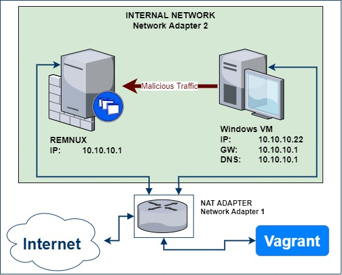
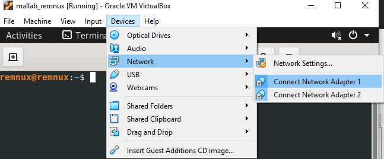
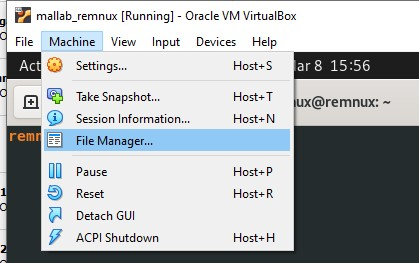
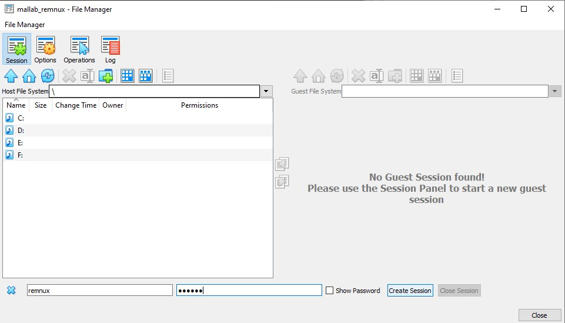

# malware analysis lab
A classical malware analysis lab environment, following the 2 box approach.   
One Windows VM is used for detonation and analysis of malware, the 2nd VM acts as a router and fakes web and other services. 



## deployment
cd into to the mallab directory and deploy the lab with 
```bash
vagrant up
```
**IMPORTANT!** 
- Disable netAdapter of the control interface (NAT interface / Network Adapter 1) after successful deployment! 
 - Otherwise malware might have access to the internet and possibly to internal network ressources!




The `Devices > Network` menu is available from the context menu of a VM. There you can **disable the interface by left-clicking** on it.

## getting files in and out
Virtualbox has a File Manager, which behaves like an inbuilt FTP client. You can access the File Manager from the VM context menu `Machine > File Manager`.



You need to provide valid credentials, for example user:password `vagrant:vagrant` to establish a connection and transfer files between your host system and the guest (VM).




## remnux start inetsim
let remnux act as a fake router that responds to all ips (`iptables`), replies to DNS requests with its own IP (`fakedns`) and serves content on different ports and protocols (`inetsim`).
```
accept-all-ips start enp0s8
fakedns -I 10.10.10.1
inetsim --bind-address 0.0.0.0
```
Take a look at the great [remnux documentation](https://docs.remnux.org/) for more information.


## how to get started with malware analysis
- [OALabs RE yt tutorials](https://www.youtube.com/c/OALabs?app=desktop)
- [dumpguy trickster csharp yt tutorials](https://www.youtube.com/@DuMpGuYTrIcKsTeR)
- [laurieWired android yt tutorials](https://www.youtube.com/@lauriewired)
- [malware unicorn RE101 - free workshop](https://malwareunicorn.org/workshops/re101.html#0)
- [MAS - malware analysis series](https://exploitreversing.com/2021/12/03/malware-analysis-series-mas-article-1/)
- [c3rb3ru5d3d53c](https://c3rb3ru5d3d53c.github.io/posts/)
- [practical malware analysis & triage - paid course](https://academy.tcm-sec.com/p/practical-malware-analysis-triage)
- [zero2auto paid course](https://courses.zero2auto.com/beginner-bundle)


## misc links 
- [sentinelLabs guide - alternative tooling script and proxy setup](https://www.sentinelone.com/labs/building-a-custom-malware-analysis-lab-environment/)
- [flareVM - all in one tooling VM](https://github.com/mandiant/flare-vm)


---


## vagrant box creation 
- downloaded current remnux and manually prepared it according to this documentation 
https://developer.hashicorp.com/vagrant/docs/providers/virtualbox/boxes

Essentially this boils down to
1. create vagrant user
2. add to sudoers group and configure NOPASSWD
3. install virtualbox guest additions
4. activate ssh

### pack the box
```powershell
vagrant package --base my_remnux
vagrant box add --force --name my_remnux ./package.box
```
- upload box to vagrant cloud ([example tut ](https://blog.ycshao.com/2017/09/16/how-to-upload-vagrant-box-to-vagrant-cloud/)- but its rather straight forward)

### init and test the box
```powershell
vagrant init my-remnux
vagrant up
```

