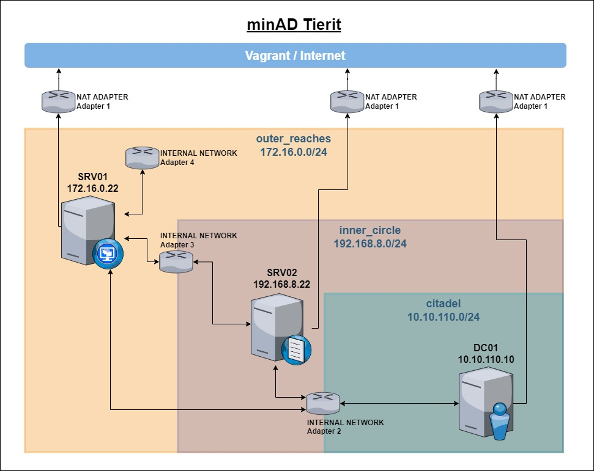

## minAD Tierit
`The beacons are lit.` 

Vagrantfile for provisioning a tiered active directory network environment.   
Creates a minimal AD deployment. Use some kind of `AD generator` to populate it.   
Take a look at `bigwhoop` for some pointers or use [theMayors ADgen](https://github.com/dievus/ADGenerator) (or get the course), where the architecture is based on.

