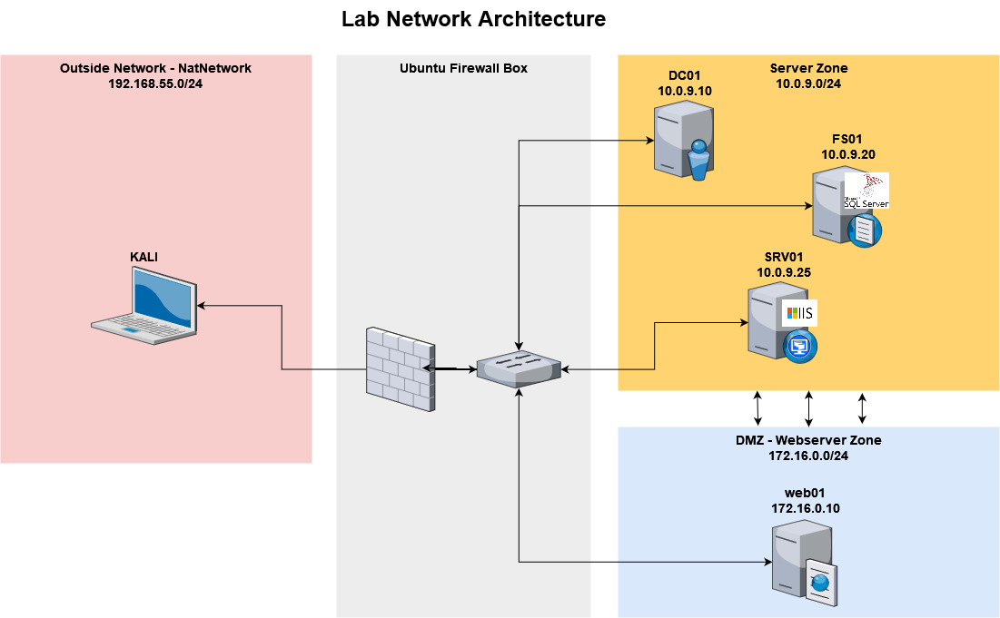

# init
This repository is my attempt at an active directory sandbox / lab environment.  
The deployment follows one simple rule: **Keep dependencies and requirements to a minimum**. This means open source or free software that is available accross platforms.   
Therefore I decided to use [VirtualBox](https://www.virtualbox.org/) + [Vagrant](https://developer.hashicorp.com/vagrant/downloads) as provider and provisioner. These are free for use in personal projects and run on every major operating system.  
Additionally this leads to all the configuration and setup scripts being either shell or powershell scripts. This makes them easily reusable under other configurations, e.g. partial deployments, ansible, etc. .   
Furthermore, since vagrant uses ruby under the hood, Vagrantfiles can be used for all sorts of things, that can be accomplished through ruby.


## arch overview


| dir | comment |
| ---|---|
| domain | Lab environment consisting of router with 2 network segments. DMZ with a nix webserver and internal net containing IIS on Server Core, MSSQL&fileshare on Server and Domain Controller |
| win10dev | dev environment for offensive tooling. Loads and installs projects and software like threatcheck, amsiTrigger, visualstudio, vscode, sysinternals, python, go, nim, c/c++ and c# build tools, x64dbg, ghidra, etc.|
| kali | kali with some additional tools, seclists, covenant docker build and neo4j/bloodhound setup |


## TLDR: how to setup?
Clone repo and `vagrant up` like so:
```
git clone https://github.com/mncmb/vagrant
cd vagrant/domain
vagrant up
```

## vagrant commands
Some useful vagrant commands.
```bash
vagrant up dc01 fs01    # only deploy specified hosts
vagrant up --provision  # restart provisioning scripts

vagrant reload web01    # restart vm 

vagrant halt            # stop all machines
vagrant destroy -f      # destroy all machines without confirmation
```

## vagrantfile ruby tricks
Vagrant files are ruby files, so you can use all sorts of ruby features 
```ruby
puts group          # ruby print 
test = []           # ruby array init
test.push host      # ruby array add
puts test           # print array

# string interpolation, see also https://stackoverflow.com/questions/19648088/pass-environment-variables-to-vagrant-shell-provisioner
shell.args   = "#{vars['VAR1']} #{vars['VAR2']}"  
```

## VBoxManage
`<provider>.customize`, which is typically used with Virtualbox to start `"modifyvm"`, can be used to access other features of **VBoxManage** like creating NatNetworks.  
On Windows, if not added to the path, it can be started with the following command when installed under its default location.
```powershell
."C:\Program Files\Oracle\VirtualBox\VBoxManage.exe"
```

## networking
Some weird things that had to be considered when doing networking with windows and vagrant:
- vagrant seems to require a NAT adapter for the first interface so that it can connect and provision the system (SSH, WinRM). For this reason every box has NAT for its first interface
- Windows boxes seem to prioritize the first interface for network interactions. This leads to issues when they are connected to a domain. DNS should then be resolved over the Domain Controller, but since interface 1 is prioritized and interface 1 needs to be NAT (see point 1 above), there will be issues. To fix this, network adapter priorization is set for every system, so that "Ethernet 2" aka adapter 2 is prioritized.
- Windows domain controllers cannot be reached by vagrant after DC promotion, unless specific WinRM options are set. (see inventory.yml and Vagrantfile)
- For firewalling I initially wanted to use OpnSense, PFSense, OpenWRT or something like that. Unfortunately there are no (working) up to date versions of those available in the default vagrant box repository. For this reason I decided to go with a simple linux box and iptables.
- Routes to NAT Network segment:


## todo 
- something, something pipeline  
    for inspiration take a look at: 
    - jenkins container, see https://blog.sunggwanchoi.com/half-automating-powersharppack/ 
    - havoc build scripts
    - offensivepipeline
- ~~add FW~~ 
- add mailserver for pw spraying and internal payload delivery
- ~~do some network segmentation~~
- bring in interesting AD misconfigs, see https://github.com/Orange-Cyberdefense/GOAD and https://github.com/Marshall-Hallenbeck/red_team_attack_lab
- ~~set domain name on each host via env var, so that argument passing to scripts can be cleaned up~~ 
- ~~create user name list based on movie with namemash.py, combined with badblood functionality~~ same but different
- check similar projects for common GPOs, check if there are any public source repos regarding reallive GPOs -> still nothing found
- add elasticcontainerproject https://www.elastic.co/de/security-labs/the-elastic-container-project 
- add velocistack https://github.com/weslambert/velocistack
- ~~change the powershell function that sets env variables so that it sets all env variables in one call, instead of one per env variable (see ruby arrays in vagrantfile for keeping it as yaml defined in inventory)~~
- modify CreateOUStructure.ps1 to reduce clutter a bit and 3lettercodes so they fit thematically in badblood `. .\Invoke-BadBlood.ps1 -NonInteractive`
- for "location names" see here, maybe there is a use for it https://shrek.fandom.com/wiki/Shrek_universe
- add documents to file share that have to do with the franchise
- add theWaffler, pencilHead and King as usernames
- ~~change interfaces for all systems~~
- ~~change/remove environment scripts -> not linux compatible and not necessarily needed~~
- ~~make it work~~
- ~~pretty stuff up~~
- port fwd
- defender exclusions and submissions
- clean up GPOs
- ~~test natnetwork auto creation, see https://docs.oracle.com/en/virtualization/virtualbox/6.0/user/vboxmanage-natnetwork.html~~
```
VBoxManage natnetwork add --netname natnet1 --network "192.168.15.0/24" --enable --dhcp on
```
- setup crAPI as webserver
- domain join the linux webserver, see

## references, etc.
This project is based on or influenced by
- [Detection Lab](https://github.com/clong/DetectionLab)
- [Red Team Attack Lab](https://github.com/Marshall-Hallenbeck/red_team_attack_lab)
- [Game of Active Directory](https://github.com/Orange-Cyberdefense/GOAD)
