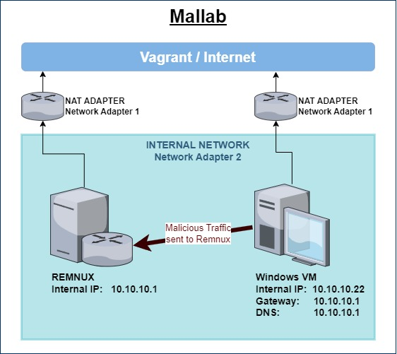

# ninevox


This project is a collection of different lab deployments.   

It follows one simple rule:   
- **keep dependencies and requirements to a minimum**
 
For this reason, [VirtualBox](https://www.virtualbox.org/) and [Vagrant](https://developer.hashicorp.com/vagrant/downloads) were used, since they are free to use in personal projects and run on every major operating system.  


# mallab
A classic malware analysis lab environment, following the 2 box approach.   
One Windows VM is used for detonation and analysis of malware, the 2nd VM acts as a router and fakes web and other services. 



# bigwhoop
`AD amusement park.`

Vagrant template to provision an active directory domain in a flat network environment. 
Also includes a setup script for the elastic container project.

This is a minimal AD domain installation and was designed as such. Use some kind of `AD generator` to misconfigure it. 


# minAD Tierit
`The beacons are lit.` 

Vagrantfile for provisioning a tiered active directory network environment, useful for practicing pivoting.   
Creates a minimal AD deployment. Use some kind of `AD generator` to populate it.   
Take a look at `bigwhoop` for some pointers or use [theMayors ADgen](https://github.com/dievus/ADGenerator) (or get the course), where the architecture is based on.


## TLDR: how to setup?
Essentially just 2 steps:
1. install virtualbox and vagrant if not already done. Make sure to have a recent version (oldest tested versions VBox 6.1+, vagrant 2.2+).
    - windows:
        ```powershell
        winget add virtualbox
        winget add vagrant
        # refresh env / open new powershell
        vagrant plugin install vagrant-reload
        ```
    - linux (replace with your package manager):
        ```
        apt install virtualbox vagrant
        vagrant plugin install vagrant-reload
        ```
2. Clone repo and `vagrant up` like so:
    ```
    git clone https://github.com/mncmb/vagrant
    cd vagrant/bigwhoop
    vagrant up
    ```

## single machine dirs
What's in there?

| directory | notes |
| ---|---|
| win10dev | dev environment. Loads and installs projects and software like threatcheck, amsiTrigger, visualstudio, vscode, sysinternals, python, go, nim, c/c++ and c# build tools, x64dbg, ghidra, etc.|
| kali | kali with some additional tools, seclists, neo4j/bloodhound setup and some open source C2s, path modifications, etc.|


## Hardware reqs
The following settings affect your local RAM and SSD usage, which is most often the limiting factor. CPU wise you should be good to go with anything that has atleast 4 Cores + Multithreading.

- 4 GB RAM per Windows box (can probably be reduced to 2GB if you are RAM starved)
- `v.linked_clone = true` Vagrant settings creates a single master image and copies that for other instances of the same windows version

The linked clone setting is the reason why you will see identical windows versions in my AD lab setups. This significantly speeds up deployment and saves local storage.  


## users
Since this is a vagrant deployment you can connect to every system with `vagrant:vagrant`.   

## network adapters
Vagrant requires __interface 1__ to be a __NAT adapter__ (not network). 

So the first interface has to stay as such for the box to be deployable by vagrant.   
This means if you do not use the vagrant commands for things like starting or stopping VMs, you may change interface 1 after the first deployment.


## vagrant commands
Some useful vagrant commands.
```bash
vagrant up dc01 fs01    # only deploy/start specified hosts
vagrant up --provision  # restart provisioning scripts for all systems

vagrant reload web01    # restart vm 

vagrant global-status   # show status of all running VMs

vagrant halt            # stop all machines
vagrant destroy -f      # destroy all machines without confirmation

vagrant ssh web01       # ssh into web01
vagrant winrm srv01     # winrm into srv01

vagrant ssh -- -L 1234:localhost:80     # do port fwd with vagrant ssh 

vagrant snapshot push   # create new snapshot
vagrant snapshot restore    # restore a snapshot
```

## vagrantfile ruby
Vagrant files are ruby files, so you can use all sorts of things you could do with ruby
```ruby
puts group              # ruby print 
test = []               # ruby array init
test.push host          # ruby array add

# string interpolation, see also https://stackoverflow.com/questions/19648088/pass-environment-variables-to-vagrant-shell-provisioner
shell.args   = "#{vars['VAR1']} #{vars['VAR2']}"  

Gem.win_platform?       # check if running on windows
defined?(vboxmanage)    # check if defined
out = `id`           # execute id command on host and capture output in out
```

## VBoxManage
On Windows, the cmdline interface for Virtualboxcan be started with the following command. This assumes you have installed Virtualbox under the default path.
```powershell
."C:\Program Files\Oracle\VirtualBox\VBoxManage.exe"
```
It can be used for many things besides configuring VMs like listing and creating Network adapters.
```powershell
vboxmanage natnetwork list 

vboxmanage natnetwork add --netname <net_adapter> --network <dhcp_range> --enable --dhcp on
```


## references, etc.
This project is based on or influenced by
- [Detection Lab](https://github.com/clong/DetectionLab)
- [Red Team Attack Lab](https://github.com/Marshall-Hallenbeck/red_team_attack_lab)
- [Game of Active Directory](https://github.com/Orange-Cyberdefense/GOAD)
- [windows-lab](https://github.com/dbroeglin/windows-lab)
- [windows domain controller vagrant](https://github.com/rgl/windows-domain-controller-vagrant)